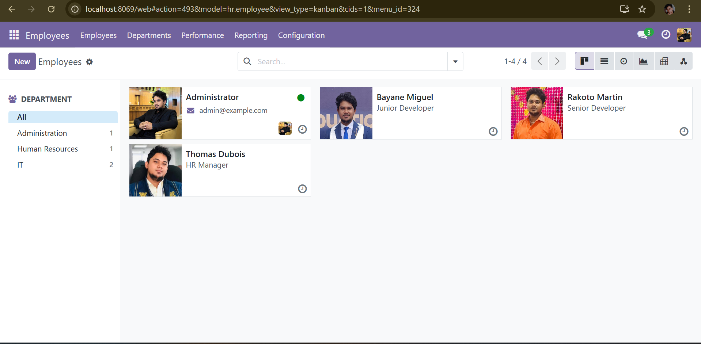
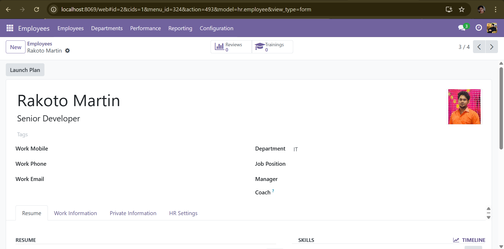
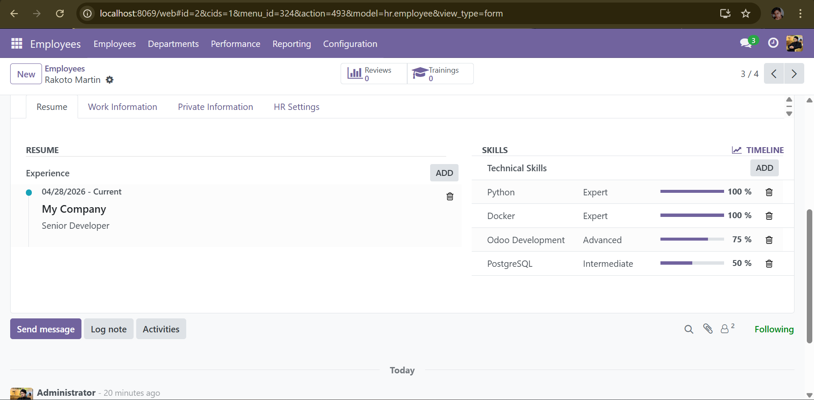
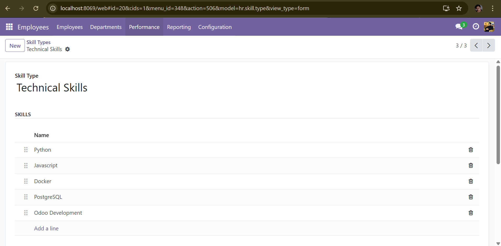
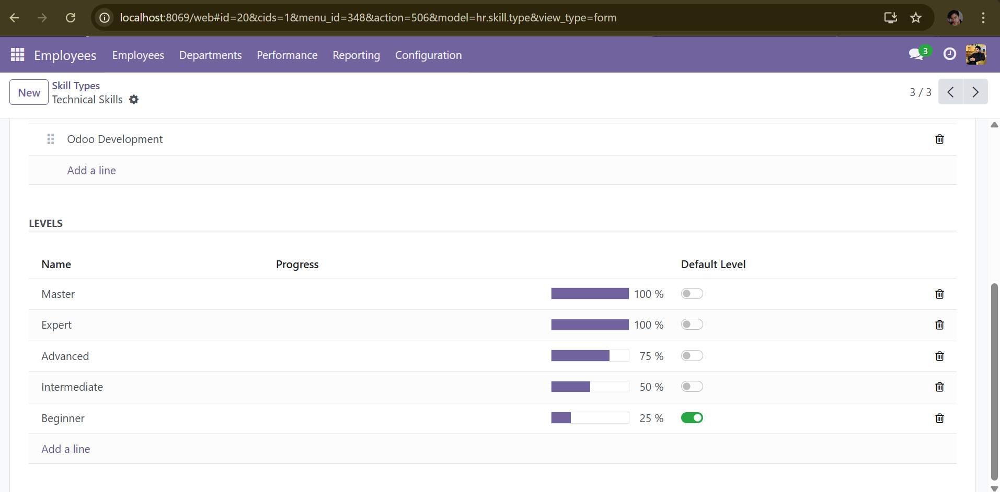
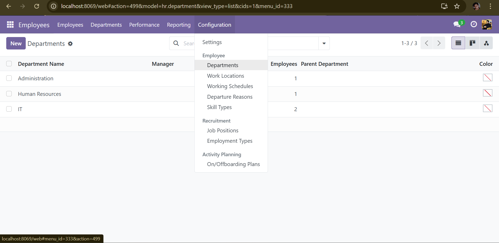

# odoo-advanced-hr

> Odoo 17 module — Employee skills matrix, performance review cycles, training plans and career path management.

## Screenshots

| Employee List | Employee Detail | Skills View |
|---|---|---|
|  |  |  |

| Add Skills | Skill Levels | Departments |
|---|---|---|
|  |  |  |

## Features

### Skills Framework
- Extends native `hr.skill`, `hr.skill.type`, `hr.skill.level` with proficiency descriptions and observable behaviors
- Employee skill validation workflow (validate + timestamp)
- Skill gap tracking: `current_level` vs `target_level` → auto-creates training plan

### Performance Reviews (`hr.performance.review`)
- Full lifecycle: Draft → Self-Assessment → Manager Review → Calibration → Completed
- 360° review type with configurable peer reviewers
- Per-competency scoring (1–5 scale) with weighted average calculation
- Automatic skill level updates on review completion
- Deadline management + Odoo activity notifications
- Daily cron: sends 3-day reminders before assessment deadlines

### Training Plans (`hr.training.plan`)
- Auto-created when a skill gap is detected
- Links skill + current level + target level + provider + cost + deadline
- On completion: automatically promotes the employee's skill level in the matrix

### Employee Enrichment
- Smart buttons: Performance Reviews, Training Plans, Skill Gaps count
- Computed KPIs: `last_review_date`, `overall_performance_score` (rolling average)
- `skills_gap_count`: number of skills below target level

## Technical highlights

| Area | Implementation |
|---|---|
| Model inheritance | Extends `hr.skill`, `hr.skill.type`, `hr.skill.level`, `hr.employee`, `hr.employee.skill` |
| Computed fields | `@api.depends` chains across related One2many (performance score rolling avg) |
| `create` override | `@api.model_create_multi` — auto-creates training plan on skill gap detection |
| State machine | 6-state performance review lifecycle with role-based transitions |
| Callbacks | `_update_employee_skills()` — writes back skill levels on review completion |
| Cron | Daily reminder + escalation cron |
| ORM patterns | `filtered()`, `mapped()`, `search_count()`, `max()` on recordsets |

## Author

**Bayane Miguel Singcol** — Odoo Developer  
[GitHub](https://github.com/Bayane-max219) · baymi312@gmail.com
